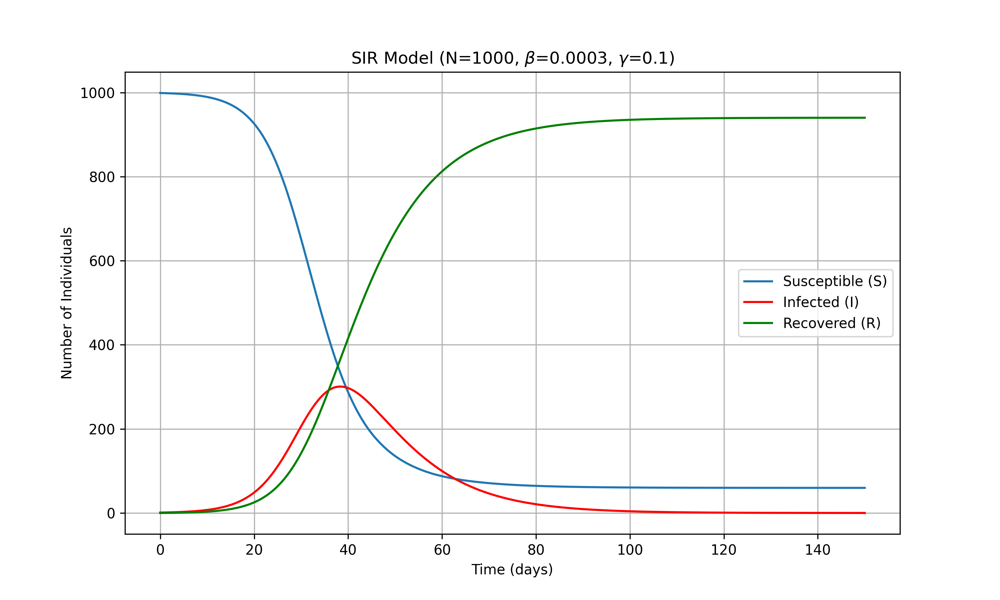
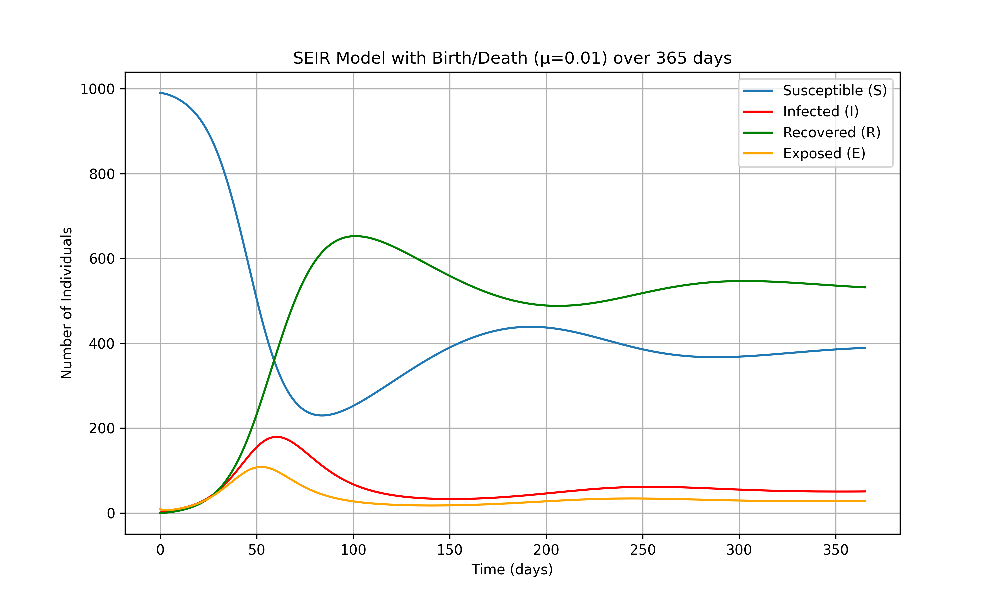
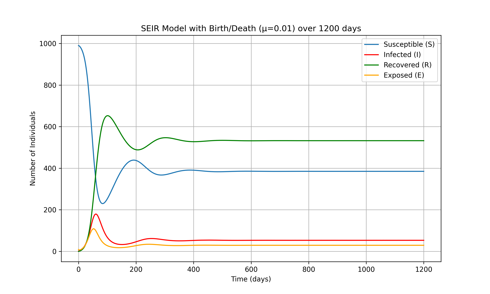
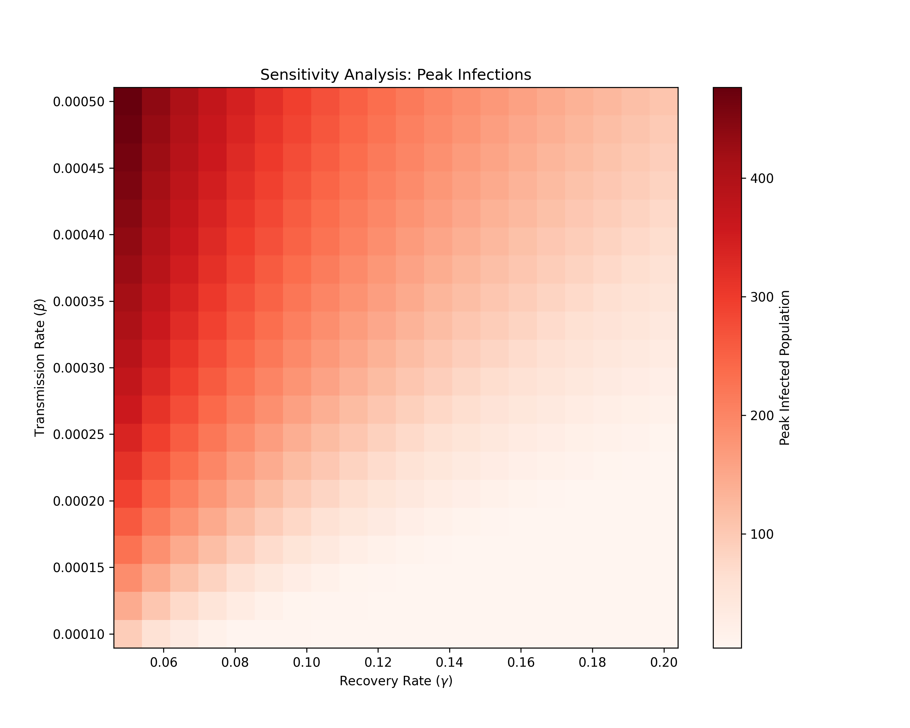
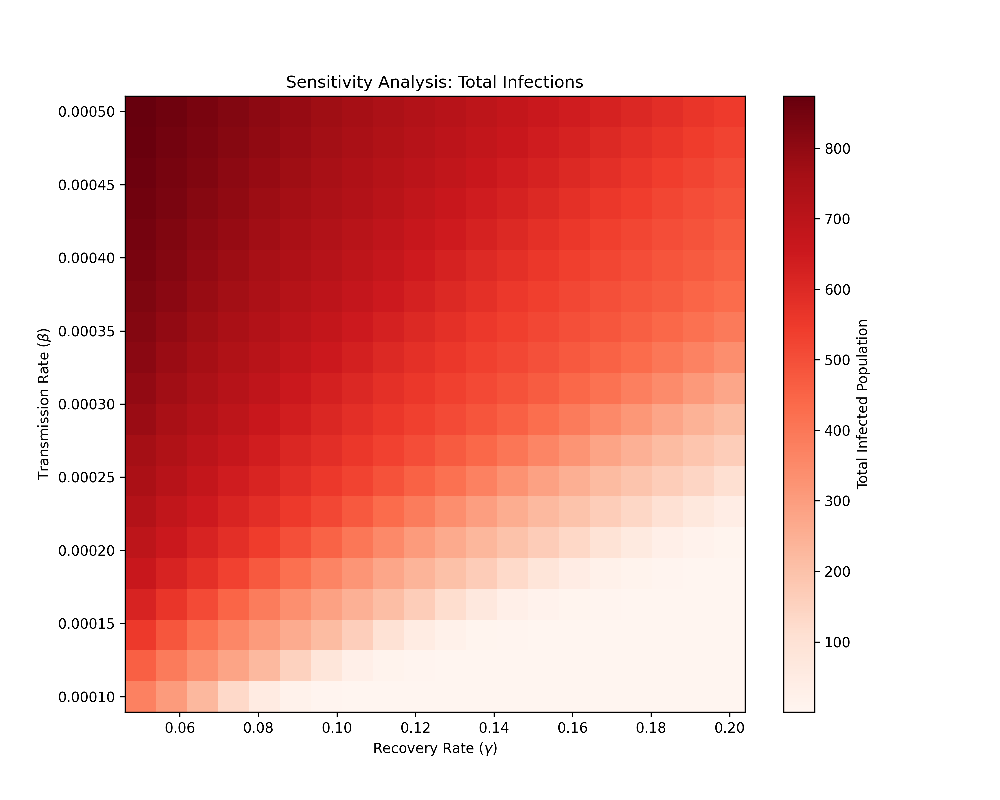

# BMI500 - Homework 11

**Author:** Yuhe Gao  
**Email:** yuhe.gao@emory.edu  

---

**Disclaimer** Gemini 2.5 Pro was used for HW11 - Question 1, on how to implement ODE solver with `scipy.integrate.solve_ivp`, and simulation example, suggestion on sensitive analysis, and final code review.
Beyond consulting the coding suggestion, the author specifically queried how a function works with different parameters and compared the results (e.g. smooth with t_eval or not).

Conversation is available at [https://gemini.google.com/share/2d3f82c65981](https://gemini.google.com/share/2d3f82c65981) or [**gemini-chat.2025-11-10.pdf**](gemini-chat.2025-11-10.pdf).

---

## Overview
**Question 1** is selected in this homework.  
Please refer to [**`Gao_BMI500_HW11.ipynb`**](Gao_BMI500_HW11.ipynb) for detailed code implementation.

---

## SIR-model

**Analysis and Interpretation**
Infection peak: the Infection reaches the peak at around 38-39 days, where the new infections equal recoveries, namely dI/dt=0, $\beta$ * S= $\gamma$. Based on assigned $\beta$ and $\gamma$, the critical threshold is $\gamma$ / $\beta$ = 333 people in the Susceptible group. And our total population is 1000, S_initial is 999, once S decreases to 333, the infection peak is reached. And if with the same $\beta$ and $\gamma$ setting, but total_population less than 333, no peak will show.

**Basic reproductive number** 
$R_0$= $\beta$ / $\gamma$ = 0.003. Given the S_initial=999, the number of people who may get infected by the initial infected person is 0.003*999=3, indicating the infection would spread out. Therefore, to lower $\beta$, the transmission rate (such as using face masks, keeping social distance), increase $\gamma$, the recovery rate (such as improving hospitalization, medications), and lower susceptible population (such as taking vaccines) are the main directions to control an infectious disease.

**Pandemic Dynamics**
The Susceptible population only decreases over time, and falls faster before the infection peak than later. There were a few people who never got infected.
The Recovery population only increases over time, and grows faster around the infection peak, and then gradually flattens the trend. It reflects the cumulated population who get infected and recover.
The Infected population increases at the beginning, reaches its peak when new infections=recoveries, and decreases after the peak. It starts with 0 and ends with 0. 

---
## SEIR-model

**Observed pattern** The infected population comes to its peak around 60 days (N of infections is around 180), and drops to a lower level (infection N = 30-40). And later, there is a small flat peak around 250 days (infection N around 60). When looking into the plot with a 1200-day range, after this small peak, the level of the infected population is steady around 50.

**Exposed compartment** It can be seen that there is a latency for exposed people and the actual infected people. Unlike the SIR model categorizes the population directly into susceptible and infected, SEIR involves an intermediate group of exposed, which mimics the real-world scenario, and lower infected population than the SIR model.

**Birth/death rate** Introducing birth/death rate into the pandemic model helps to simulate the changes in a more realistic long-term trend. It guarantees new population coming into the Susceptible group. In the SIR model, the population is fixed. When people get infected from susceptible and then finally recover, they will be immune, and no changes will happen. Involving birth/death rate, SEIR mimics the situation that allows the infectious disease to co-exist with people.

### Sensitivity analysis

As discussed before, **implications for public health interventions** can happen on $\gamma$ or $\beta$. From the sensitivity analysis, to control the pandemic on either peak population or total infections, a lower transmission rate or a higher recovery rate is expected. With $\gamma$ representing the recovery rate, focusing on improving hospitalization, medication, good rest, etc., can help to increase the recovery rate and limit the infection. With $\beta$ representing the transmission rate, applying social distancing, using face masks, and contactless interaction will help to constrain the transmission and control the spread.

---

## Summary
Compared to the SIR model, the SEIR model is more reliable for predicting real-world scenarios. The exposed group introduces an intermediate population between susceptible and infected, which lowers the infected population on both peak and total, and is closer to the realistic situation that allows people to get exposed first. Involving birth/death rate further avoids a closed population, as in the SIR model. It ensures a non-zero susceptible population and mimics the pandemic spread over a long time range.
The comparison of SIR and SEIR models demonstrated that it is crucial to consider the real-world constraints and effective features when developing a comprehensive and generalizable model-based machine learning method.